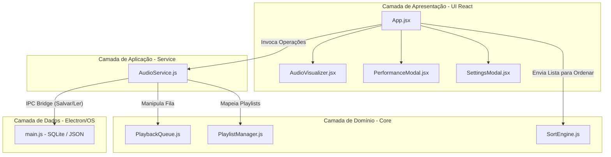

# Design Técnico e MVP — E2
**Estrutura de Dados**

---

## Identificação do Grupo

| Campo | Preenchimento                               |
|-------|---------------------------------------------|
| Nome do projeto | Stardust Music Player                       |
| Repositório GitHub | [https://github.com/GRXMiT/StardustMusicPlayer](https://github.com/GRXMiT/StardustMusicPlayer) |
| Integrante 1 | Gabriel Rodrigues Schmidt — 45258848        |

---

## 1. Escolha e Justificativa das Estruturas de Dados

### Estrutura 1 — Fila de Reprodução (PlaybackQueue)

**Nome completo e categoria:**
Fila baseada em Dicionário/Objeto — Estrutura linear dinâmica com acesso por indexação contígua simulada.

**Complexidade das operações principais:**

| Operação | Tempo | Espaço | Observação |
|----------|-------|--------|------------|
| Inserção | O(1)  | O(1)   | Operação `enqueue` no final da fila utilizando o ponteiro `tail`. |
| Remoção  | O(1)  | O(1)   | Operação `dequeue` no início da fila utilizando o ponteiro `head`. |
| Busca    | O(n)  | O(1)   | Varredura linear necessária para localizar um elemento específico. |
| Acesso   | O(1)  | O(1)   | Operação `peek` acessa diretamente o elemento apontado por `head`. |

**Justificativa de escolha:**
Num leitor de música, as faixas adicionadas à fila de espera ("Up Next") devem ser reproduzidas estritamente na ordem em que foram inseridas, caracterizando o comportamento FIFO (First-In, First-Out). A utilização de um objeto JavaScript com apontadores numéricos (`head` e `tail`) garante que a remoção do primeiro elemento ocorra em tempo constante O(1), evitando degradação de performance na interface gráfica durante a troca de músicas.

**Alternativa descartada:**
Array nativo (`Array.prototype.shift()`) — Descartado porque a operação `shift()` em arrays JavaScript tradicionais possui complexidade de tempo O(n), já que a engine precisa reorganizar e reindexar todos os elementos subsequentes na memória a cada música finalizada.

**Limitações conhecidas:**
A estrutura puramente implementada não suporta de forma nativa a inserção ou remoção arbitrária de elementos no meio da fila em tempo constante (operações úteis para reordenar a fila por arrasto), exigindo uma conversão temporária para Array O(n) na camada de UI quando necessário.

**Referência bibliográfica:**
CORMEN, T. H. et al. Introdução a Algoritmos. 3. ed. Rio de Janeiro: Elsevier, 2012.

---

### Estrutura 2 — Algoritmos de Ordenação (SortEngine)

**Nome completo e categoria:**
Merge Sort e Bubble Sort — Algoritmos de ordenação aplicados sobre estruturas lineares (Arrays).

**Complexidade das operações principais:**

| Algoritmo | Tempo (Pior Caso) | Tempo (Melhor Caso) | Espaço (Auxiliar) | Observação |
|-----------|-------------------|---------------------|-------------------|------------|
| Merge Sort| O(n log n)        | O(n log n)          | O(n)              | Algoritmo estável baseado em divisão e conquista. |
| Bubble Sort| O(n²)            | O(n²)               | O(1)              | Algoritmo iterativo por trocas adjacentes. |

**Justificativa de escolha:**
A inclusão de dois algoritmos com ordens de complexidade marcadamente distintas (O(n log n) vs O(n²)) foi feita para alimentar o **Performance Dashboard (Telemetria)** exigido pelo MVP. O Merge Sort garante estabilidade na ordenação da biblioteca (mantendo a ordem original de músicas com o mesmo metadado) e tempo previsível mesmo para coleções massivas de arquivos locais. O Bubble Sort atua como o contra-exemplo ineficiente.

**Alternativa descartada:**
Quick Sort — Descartado porque, apesar de ser executado in-place (O(1) espaço auxiliar), possui um pior caso de tempo O(n²) se o pivô for mal escolhido e não é um algoritmo estável nativamente, o que desorganizaria sub-ordenações feitas pelo usuário.

**Limitações conhecidas:**
O Merge Sort requer alocação de memória auxiliar proporcional ao número de músicas na biblioteca O(n).

**Referência bibliográfica:**
GOODRICH, M. T.; TAMASSIA, R. Estruturas de Dados e Algoritmos em Java. 5. ed. Porto Alegre: Bookman, 2013.

---

### Estrutura 3 — Gerenciador de Playlists (PlaylistManager)

**Nome completo e categoria:**
Tabela de Dispersão / Mapa Associativo — Estrutura associativa mapeando Chaves Únicas (Strings) para Coleções Dinâmicas (Arrays).

**Complexidade das operações principais:**

| Operação | Tempo | Espaço | Observação |
|----------|-------|--------|------------|
| Inserção | O(1)  | O(1)   | Criação de uma playlist vazia ou inserção de chave no objeto global. |
| Remoção  | O(1)  | O(1)   | Remoção da playlist inteira por eliminação da chave (`delete`). |
| Busca    | O(1)  | O(1)   | Recuperação instantânea de um array de músicas pelo nome da playlist. |
| Acesso   | O(1)  | O(1)   | Acesso ao dicionário mapeado em memória RAM. |

**Justificativa de escolha:**
O utilizador interage com as suas playlists através do nome (ex: "Favoritas", "Treino"). A utilização de um dicionário na memória RAM permite que o sistema crie, valide a existência ou elimine uma playlist instantaneamente em tempo constante O(1), sem precisar de percorrer sequencialmente uma lista de coleções.

**Alternativa descartada:**
Lista Encadeada de Playlists — Descartada porque a validação de duplicados na criação ou a busca de uma playlist pelo nome exigiria uma varredura sequencial de tempo O(n), tornando o sistema ineficiente.

**Limitações conhecidas:**
A remoção de uma música específica de dentro da playlist opera em tempo O(k) (onde k é o tamanho da playlist).

**Referência bibliográfica:**
SZWARCFITER, J. L.; MARKENZON, L. Estruturas de Dados e seus Algoritmos. 3. ed. Rio de Janeiro: LTC, 2010.

---

## 2. Arquitetura em Camadas

**Diagrama:**



**Descrição das camadas:**

| Camada | Nome no seu projeto | Responsabilidade |
|--------|---------------------|-----------------|
| Apresentação (UI/CLI) | `src/components/` e `App.jsx` | Renderiza o Player, recebe cliques do usuário (play, queue, sort) e exibe o visualizador em Canvas/WebGL. |
| Aplicação (Service) | `src/service/AudioService.js` | Orquestra a regra de negócio. Conecta a UI às estruturas de dados e gerencia a ponte IPC com o Electron para salvar os dados no disco. |
| Domínio (Core) | `src/core/` | Implementação pura das Estruturas de Dados (PlaybackQueue, PlaylistManager, SortEngine). Sem dependências externas. |
| Persistência (Extra) | `electron/main.js` | Backend em Node.js que lê os arquivos físicos de áudio (`.mp3`), busca metadados e armazena cache em banco SQLite local. |

**Como as camadas se comunicam:**
A interface React (Apresentação) captura um clique na lista de músicas e chama o `AudioService` (Aplicação). O `AudioService` invoca o método `enqueue()` da `PlaybackQueue` (Domínio). Após atualizar o estado em memória (O(1)), a camada de aplicação despacha o novo estado via IPC para o Electron (Persistência) salvar em um arquivo JSON e retorna a fila atualizada para a Interface renderizar a seção "Up Next".

---

## 3. Estrutura de Diretórios

```
/
├── electron/          # Backend de persistência e leitura de OS nativo
├── src/
│   ├── assets/        # Imagens e ícones
│   ├── components/    # (UI) Componentes da Interface React
│   ├── core/          # Implementação das Estruturas de Dados
│   ├── service/       # Lógica de negócio e orquestração
│   ├── App.jsx        # (UI) Controller e View principal
│   └── main.jsx       # Entrypoint do React
├── tests/             # Testes unitários (Vitest)
├── data/              # Modelos de demonstração e .jsons
└── README.md
```

**Justificativa de desvios (se houver):**
O projeto segue o padrão, exceto pela nomenclatura da camada de `ui/` que foi adaptada para `components/` e a raiz `src/`, que é o padrão da indústria para aplicações construídas com a biblioteca React (Vite). Foi adicionada a pasta `electron/` para lidar com a leitura segura do sistema de arquivos nativo do usuário.

---

## 4. Backlog do Projeto

### In-Scope — O que será implementado

**Item 1: Fila Dinâmica de Reprodução (Queue)**
Critério de aceite:
> **Dado** o player em execução com uma música, **quando** o usuário clicar em "Add to Queue" em uma nova música, **então** a música deve ir para o fim da fila de reprodução, visível no painel "Up Next", usando tempo O(1).

**Item 2: Ordenação da Biblioteca**
Critério de aceite:
> **Dado** a biblioteca de músicas carregada, **quando** o usuário selecionar a ordenação por "Artista" e escolher o algoritmo "Merge Sort", **então** a lista na tela deve ser reordenada alfabeticamente pelo nome do artista usando o método de divisão e conquista.

**Item 3: Dashboard de Performance de Algoritmos**
Critério de aceite:
> **Dado** a biblioteca visível, **quando** o usuário abrir o painel de telemetria ("Analisar") e rodar os algoritmos de ordenação, **então** o sistema deve exibir graficamente em milissegundos o tempo que o Bubble Sort e o Merge Sort levaram para ordenar a lista atual.

**Item 4: Gerenciamento de Playlists (Dicionário)**
Critério de aceite:
> **Dado** que o usuário abriu o modal de playlists, **quando** digitar um nome e clicar em criar, **então** uma nova chave de vetor vazio deve ser inserida instantaneamente no Dicionário O(1) e o nome deve aparecer no painel lateral.

**Item 5: Persistência de Estado (Cache)**
Critério de aceite:
> **Dado** que o usuário gerou uma fila de reprodução, **quando** ele fechar e reabrir o programa, **então** a fila inteira deve ser lida do arquivo `queue.json` e restaurada exatamente no mesmo estado.

---

### Out-of-Scope — O que não será implementado

| Funcionalidade | Motivo de exclusão |
|----------------|--------------------|
| **Streaming de Internet (Spotify API)** | Foge do escopo local. O player vai ler apenas arquivos físicos (`.mp3`, `.wav`) do disco do usuário para demonstrar manipulação pura de dados. |
| **Edição de Metadados (ID3 Tags)** | Complexidade elevada e fora do escopo de ED. O player faz apenas a *leitura* do artista/capa da música, mas não edita o arquivo original do usuário. |
| **Sincronização em Nuvem** | Não agrega ao aprendizado do conteúdo de ED, já que os dados de estado (playlists, fila) serão salvos localmente num backend Electron. |

---

## 5. Repositório GitHub

**Link do repositório:** [https://github.com/GRXMiT/StardustMusicPlayer](https://github.com/GRXMiT/StardustMusicPlayer)

**Checklist do repositório:**
- [x] Repositório público com nome descritivo
- [x] `.gitignore` configurado para a linguagem escolhida
- [x] `README.md` com nome, descrição e instruções de execução
- [x] Mínimo de 5 commits com prefixos semânticos

**Como executar o projeto**:
```bash
# Clone o repositório
git clone https://github.com/GRXMiT/StardustMusicPlayer

# Entre no diretório
cd StardustMusicPlayer

# Instale as dependências
npm install

# Inicie o projeto em ambiente de desenvolvimento (React + Electron)
npm run start
```

---

## 6. Implementação do Núcleo

### 6.1 Estrutura implementada: PlaybackQueue (Fila)

**Linguagem:** JavaScript (ES6)

**Localização no repositório:** `src/core/PlaybackQueue.js`

**Operações implementadas:**

| Operação | Implementada? | Observação |
|----------|---------------|------------|
| Inserir (Enqueue) | ✅ | Alocação O(1) indexada no fim |
| Remover (Dequeue) | ✅ | Remoção O(1) baseada no ponteiro de head |
| Buscar / Peek | ✅ | Lê a posição da Head |
| Exibir / getQueueState | ✅ | Varre os itens existentes para a UI |

**Trecho representativo do código**:

```javascript
export class PlaybackQueue {
    constructor() {
        this.items = {}; // Objeto que atua como bloco de memória
        this.head = 0;   
        this.tail = 0;   
    }

    enqueue(track) {
        this.items[this.tail] = track;
        this.tail++;
    }

    dequeue() {
        if (this.isEmpty()) throw new Error("ERROR: The playback queue is empty.");
        
        const track = this.items[this.head];
        delete this.items[this.head];
        this.head++;
        return track;
    }
}
```

**Leitura de arquivo:**
O sistema utiliza o backend Node.js (`electron/main.js`) para ler nativamente as pastas do sistema operacional através do módulo `fs.promises.readdir()`. Ele filtra arquivos `.mp3` e extrai seus metadados (título, artista, imagem de capa). Para garantir desempenho de leitura sub-sequente, os metadados são inseridos num banco de dados relacional (SQLite nativo do Node) mantido localmente. As playlists e filas de reprodução são salvas no disco utilizando formatação JSON simples (`queue.json`).

---

## 7. MVP — Mínimo Produto Viável

### 7.1 Tipo de interface
- [x] GUI Desktop (React + Electron App)

### 7.2 Tela 1 — Boas-vindas / Menu Principal

**Descrição:** Tela inicial obrigatória pelo MVP, com o nome do projeto (Stardust) que bloqueia o usuário até iniciar explicitamente o módulo do Player.

**Print ou representação textual:**
```text
=======================================
               STARDUST
     Projeto de Estruturas de Dados

        [ INICIAR PLAYER ]
=======================================
```

**Comportamentos implementados nesta tela:**
- [x] Nome do sistema exibido
- [x] Lista de operações / Ponto de partida
- [x] Opção de iniciar

---

### 7.3 Tela 2 — Entrada de Dados (Painel Central e Settings)

**Descrição:** O usuário acessa as configurações para indicar uma pasta nativa do Windows onde suas músicas estão armazenadas. Ele também interage com a entrada de dados criando Playlists e pesquisando músicas pela barra superior.

**Print ou representação textual:**
```text
[ Settings ]
Local Music Folders:
📁 E:\OneDrive\Bibliotecas\Músicas         [Remove]
[ + Add Folder ]
```

**Comportamentos implementados nesta tela:**
- [x] Opção de carregar diretório/arquivos
- [x] Prompt de texto para criação de Playlist
- [x] Confirmação e carregamento da biblioteca no painel lateral

---

### 7.4 Tela 3 — Resultado (Player Principal e Performance)

**Descrição:** A tela principal exibe a Lista atual ordenada, o painel "My Playlists" e a "Fila (Queue)". O painel "Performance Dashboard" é o resultado prático da execução das lógicas de ED aplicadas à ordenação da lista de músicas.

**Print ou representação textual:**
```text
=============================================================
Library                         [Visualizer de Áudio 3D]
[Search...] [Merge Sort v]
1. Wake Me Up - Avicii          Current Track: Wake Me Up
2. Levels - Avicii
                                Up Next (Queue):
My Playlists:                   ▶ Levels
[+ New]                         - Carry You (Martin Garrix)
Favoritas (12 tracks)           
Treino (4 tracks)               [ Clear Queue ]
=============================================================
```

**Comportamentos implementados nesta tela:**
- [x] Resultado da operação executada (Fila processada, Dashboard rodando os tempos de Algoritmos)
- [x] Estado atual completo da estrutura visível na interface
- [x] Mensagem de erro capturada com validações (ex: tentar criar Playlist sem nome)

### 7.5 Fluxo completo demonstrado

**Cenário:** Carregar biblioteca, analisar performance e manipular fila.

```text
1. O usuário clica em "Iniciar Player".
2. O usuário clica em "Settings" -> "+ Add Folder" -> Adiciona a pasta "Músicas".
3. A fila é carregada. O usuário clica em "ANALISAR" e abre a telemetria.
4. Seleciona "Por Artista" e "Bubble Sort" -> O sistema registra O(n²) em ~4.5ms.
5. Seleciona "Por Artista" e "Merge Sort" -> O sistema registra O(n log n) em ~1.2ms (gráfico atualiza).
6. Na lista da Library, o usuário clica com o botão direito numa música -> "Add to Queue".
7. A música aparece no final do painel "Up Next" ao lado direito (Fila operando em O(1)).
8. Quando a música atual termina, o Player invoca `dequeue()` e a próxima música toca.
```

---

## 8. Testes Unitários

**Framework de testes utilizado:** Vitest (comportamento idêntico ao Jest)
**Localização:** `tests/PlaybackQueue.test.js`

### Estrutura testada: PlaybackQueue (Fila)

---

**Teste 1 — Caso base**
Descrição: Garante que enfileirar e desenfileirar uma única faixa mantém a fila consistente.
```javascript
it('should correctly enqueue and dequeue a single track', () => {
    const track = { name: "Test Song", artist: "Test Artist" };
    queue.enqueue(track);
    expect(queue.isEmpty()).toBe(false);
    expect(queue.peek()).toEqual(track);

    const dequeuedTrack = queue.dequeue();
    expect(dequeuedTrack).toEqual(track);
    expect(queue.isEmpty()).toBe(true);
});
```
Resultado: ✅ Passando

---

**Teste 2 — Caso vazio**
Descrição: Lança erro de validação ao tentar consumir `dequeue` em uma fila que já está vazia.
```javascript
it('should throw an error when trying to dequeue an empty queue', () => {
    expect(queue.isEmpty()).toBe(true);
    expect(() => queue.dequeue()).toThrowError("ERROR: The playback queue is empty.");
});
```
Resultado: ✅ Passando

---

**Teste 3 — Caso com múltiplos elementos**
Descrição: Verifica o comportamento O(1) de ponteiros ao processar múltiplos itens, garantindo que a ordem natural (FIFO) seja mantida perfeitamente sem degradar o índice.
```javascript
it('should handle multiple tracks maintaining FIFO order', () => {
    queue.enqueue({ name: "Song 1" });
    queue.enqueue({ name: "Song 2" });
    queue.enqueue({ name: "Song 3" });

    expect(queue.dequeue().name).toBe("Song 1");
    expect(queue.dequeue().name).toBe("Song 2");

    expect(queue.getQueueState().length).toBe(1);
    expect(queue.peek().name).toBe("Song 3");
});
```
Resultado: ✅ Passando

---